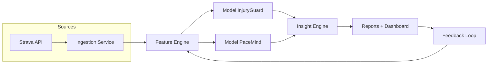

# 🏃‍♂️ Runlytics v1 — Spécifications Produit & Techniques
> *“Le coach IA qui prédit ton chrono et ton risque.”*

---

## 1. Vision produit

Runlytics fusionne deux moteurs :
- **PaceMind** → optimisation de la performance & stratégie de course  
- **Injury Guard** → prévention de blessure et gestion de la charge  

L’objectif : offrir au coureur une **analyse complète, prédictive et actionnable** sur sa santé et sa performance.  
Chaque semaine, l’IA évalue la forme, détecte les risques, et ajuste automatiquement les recommandations.

---

## 2. Objectifs fonctionnels

- Analyser automatiquement les entraînements (Strava/Garmin)
- Calculer les indicateurs de charge, fatigue, variabilité et efficacité  
- Prédire :  
  - le **risque blessure (14j)**  
  - le **chrono prévisionnel sur course cible**
- Générer un **rapport narratif clair** et un **plan hebdo adapté**

---

## 3. Personas

| Persona | Objectif | Besoin |
|----------|-----------|--------|
| **Coureur régulier** | Progresser sans se blesser | Bilan clair et suivi fiable |
| **Coureur compétiteur** | Optimiser sa stratégie de course | Prévision chrono + pacing intelligent |
| **Coach** | Gérer plusieurs athlètes | Vue synthétique sur forme et risque (V2) |

---

## 4. Cas d’usage clés

1. **Bilan hebdomadaire**  
   > “Ta charge monte de +12 %. Ton endurance progresse, mais ta récupération baisse.”  
2. **Prédiction de course**  
   > “Semi : 1h42 estimé. Pacing recommandé 4’52/km.”  
3. **Risque blessure**  
   > “Risque modéré (32 %) : dors plus, réduis volume de 15 %.”  
4. **Plan adaptatif**  
   > “Cette semaine : 2 EF + 1 tempo + 1 récup active.”

---

## 5. Architecture technique

| Composant | Stack | Description |
|------------|--------|-------------|
| **Backend API** | NestJS + Prisma + PostgreSQL | Auth, ingestion, endpoints |
| **Frontend** | Next.js 15 + Tailwind + shadcn/ui | Dashboard interactif |
| **Feature Engine** | Node workers (BullMQ) | Calcul ACWR, EF index, variances |
| **ML Layer** | ML.js / TensorFlow.js | InjuryGuard + PaceMind |
| **Storage** | PostgreSQL + MinIO | Data & modèles |
| **Auth** | OAuth2 Strava / Garmin | Synchronisation activités |
| **Infra** | Docker + GitHub Actions + Render | CI/CD MVP |
| **Monitoring** | Sentry + Prometheus | Observabilité |

---

## 6. Modèles IA

### **A. Injury Guard Model**
| Type | Logistic Regression / Random Forest |
|------|-------------------------------------|
| Input | charge, HRV, sommeil, EF index, RPE |
| Output | `risk_score` (0–100) + causes principales |
| Label | blessure dans les 14j (0/1) |

### **B. PaceMind Model**
| Type | Regression + Pattern Detection |
|------|--------------------------------|
| Input | course, HR, D+, météo, charge récente |
| Output | `predicted_time`, `optimal_pacing` |
| Label | chrono réel |

---

## 7. Données principales

| Table | Description |
|--------|--------------|
| `users` | profil, tokens, préférences |
| `activities` | séances brutes Strava |
| `features_weekly` | agrégats par semaine |
| `predictions` | résultats des modèles |
| `reports` | synthèses IA |
| `feedbacks` | fatigue, douleur, ressenti |

---

## 8. Boucle d’apprentissage

```mermaid
flowchart TD
    A[Data Import (Strava)] --> B[Feature Extraction]
    B --> C[AI Models]
    C --> D[Insight Engine]
    D --> E[User Feedback]
    E --> F[Model Recalibration]
    F --> B
```

---

## 9. Diagramme Dataflow technique



---

## 10. Exemple d’insight JSON

```json
{
  "user_id": "nicolas_001",
  "week": "2025-W42",
  "injury_risk": 0.28,
  "predicted_time": "3:48:00",
  "pacing_plan": "4’54/km – 5’01/km",
  "insights": [
    "Ta charge augmente de +9 %, ce qui reste dans la zone sûre.",
    "Ton EF index s'améliore (-5 sec/km à FC stable).",
    "Risque blessure modéré (28 %). Continue la récupération active."
  ]
}
```

---

#  **Fiche Produit — Branding & Storytelling**

## Mission
> **Aider les coureurs à performer durablement.**  
> Grâce à l’intelligence artificielle, Runlytics traduit les données brutes en décisions intelligentes.

---

## Tagline
> “**Runlytics** — Ton coach IA qui prédit ton chrono et ton risque.”

---

## Positionnement
| Marque | Style | Position |
|---------|-------|-----------|
| **Strava** | Social, gamifié | Fun mais pas analytique |
| **TrainingPeaks** | Technique, orienté coach | Pro, mais froid |
| **Runlytics** | Intelligent, humain, préventif | Performance durable |

---

## Valeurs de marque
- **Clarté** → pas de jargon, des explications simples  
- **Empathie** → comprendre le coureur, pas le juger  
- **Durabilité** → performance sans blessure  
- **Intelligence** → chaque donnée a du sens  
- **Simplicité** → tout tient en une phrase :  
  > “Tu cours. Je t’explique ton corps.”

---

## Expérience utilisateur
1. Connexion via Strava  
2. Tableau de bord hebdo clair et lisible  
3. Rapport IA narratif (pas un graphique illisible)  
4. Plan de course ou d’entraînement adapté  
5. Notification IA personnalisée :
   > “Tu peux viser 1h41, mais attention à la fatigue : dors mieux ce week-end.”

---

## Business Model

| Offre | Prix | Fonctionnalités |
|--------|------|----------------|
| **Freemium** | Gratuit | Rapport hebdo simplifié |
| **Premium** | 9,90 €/mois | Pacing IA + risque + recommandations |
| **Coach / Club (V2)** | 49 €/mois | Multi-athlètes + API + export |

---

## Roadmap MVP (6 semaines)

| Semaine | Livrable | Objectif |
|----------|-----------|-----------|
| 1 | Auth + Import Strava | Connexion + stockage |
| 2 | Feature Engine v1 | ACWR + EF index |
| 3 | Injury Guard model | Score de risque |
| 4 | PaceMind model | ETA + pacing |
| 5 | Insight Engine + UI | Rapport IA complet |
| 6 | Alpha test | Feedback réel + recalibration |

---

## Pitch résumé (externe)

> **Runlytics**, c’est l’assistant IA du coureur moderne.  
> Il analyse ta semaine, comprend ton corps, prédit ton chrono, et t’empêche de te blesser.  
>  
> Là où Strava montre des courbes, **Runlytics te parle comme un coach.**  
>  
> **Runlytics = Performance × Prévention.**
